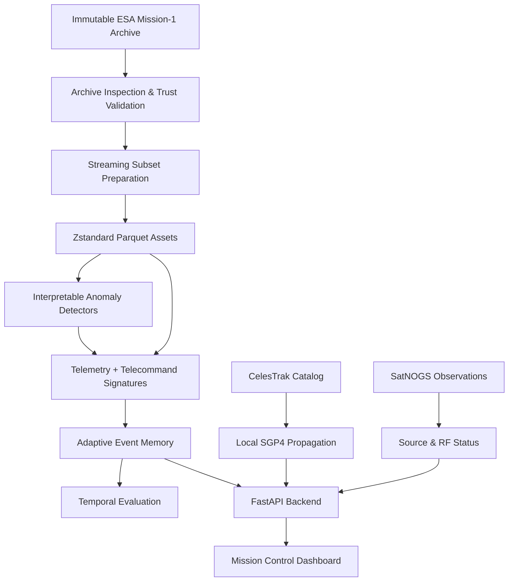

<div align="center">

# 🛰️ ASTRA

### **Spacecraft Telemetry Health Intelligence Platform**

*Detect unusual spacecraft behavior. Remember validated operations. Keep the human in the loop.*

<p>
  
  
  
  
  
</p>

<p>
  
  
  
  
</p>

---

### 🧠 **Unusual does not always mean unsafe.**

### ASTRA explores whether spacecraft anomaly detection can become **context-aware**.

Instead of treating every statistically unusual telemetry pattern as a failure,
ASTRA combines **telemetry evidence + operational context + validated operator memory**
while preserving a dedicated protection mechanism for potentially genuine anomalies.

<br/>

> **Detect → Understand → Remember → Protect → Explain**

</div>

---

# 🚀 What is ASTRA?

**ASTRA** is a research-driven spacecraft health intelligence platform designed to investigate a specific operational problem:

> **A spacecraft telemetry system may raise an alarm for an event that is statistically rare or unusual, even though the event was planned, expected, and completely nominal from an operator's perspective.**

Spacecraft do not always behave like a perfectly stationary system.

Maneuvers happen.

Communications windows happen.

Operational procedures change telemetry distributions.

Some valid spacecraft activities may therefore look suspicious to a detector that only understands statistical normality.

ASTRA explores whether **operational context and operator-validated event memory** can reduce these unnecessary alarms without materially weakening the detection of genuine anomalies.

The project is intentionally structured as a **research system rather than a claim-generating demo**.

That distinction matters.

ASTRA does **not** currently claim that its hypothesis has been proven. Dataset observations, engineering behavior, exploratory measurements, demonstration scenarios, and future experiments are deliberately kept separate.

---

# 🎯 The Research Question

<div align="center">

## **Can operational context and operator-validated event memory reduce false spacecraft anomaly alarms caused by rare nominal events without materially reducing genuine anomaly detection?**

</div>

ASTRA approaches this question through a controlled pipeline:

```text
                    SPACECRAFT TELEMETRY
                            │
                            ▼
                 ┌─────────────────────┐
                 │  Anomaly Detection  │
                 └──────────┬──────────┘
                            │
                     Unusual Event?
                            │
                            ▼
                 ┌─────────────────────┐
                 │ Operational Context │
                 └──────────┬──────────┘
                            │
                            ▼
                 ┌─────────────────────┐
                 │   Event Signature   │
                 └──────────┬──────────┘
                            │
                            ▼
                 ┌─────────────────────┐
                 │  Operator Memory    │
                 └──────────┬──────────┘
                            │
                  ┌─────────┴─────────┐
                  │                   │
                  ▼                   ▼
             Known Event         First Seen
                  │                   │
                  ▼                   ▼
             Contextual          Operator
             Downgrade             Review
                                      │
                                      ▼
                             Validated Pattern
                                      │
                                      ▼
                               Memory Updated
```

At the same time, a **genuine-anomaly protection guard** prevents a superficially similar historical event from automatically suppressing a sufficiently strong anomaly signal.

---

# 🛰️ Why This Matters

Traditional anomaly detection often answers:

> **"Is this telemetry unusual?"**

But spacecraft operations frequently require a different question:

> **"Is this unusual telemetry unexpected given what the spacecraft is doing?"**

That difference is critical.

A telemetry sequence can be:

* statistically unusual,
* operationally expected,
* previously validated,
* and completely safe.

If every unusual event becomes an alarm, operators may experience:

### 🔴 Alert Fatigue

Too many low-value alerts can make genuinely important signals harder to notice.

### 🔴 Context Blindness

A detector may see the telemetry pattern without knowing what operation caused it.

### 🔴 Repeated Investigation

The same validated operational pattern may repeatedly trigger investigation.

### 🔴 Risk of Over-Suppression

Simply learning that something happened before is not enough.

A previously observed event could resemble a future anomaly.

ASTRA therefore treats **memory as contextual evidence — not permission to ignore anomalies.**

---

# 🧩 The ASTRA Approach

ASTRA follows five major steps:

### 01 — Detect

Use interpretable anomaly detection to identify telemetry behavior that differs from the expected pattern.

### 02 — Contextualize

Enrich the event with operational context, including telemetry statistics and telecommand activity.

### 03 — Remember

Compare the resulting event signature against patterns previously validated by an operator.

### 04 — Protect

Use an explicit anomaly-protection guard so sufficiently strong anomaly evidence remains actionable.

### 05 — Explain

Preserve the evidence used to reach the resulting classification instead of producing an unexplained black-box decision.

These principles form the core research workflow.

---

# ✨ Core Features

<table>
<tr>

<td align="center" width="25%">

### 🔬

## Research Core

Archive inspection, safe extraction, feature generation, anomaly detection and temporal evaluation.

</td>

<td align="center" width="25%">

### 🧠

## Adaptive Memory

Remember event patterns validated by operators and compare future events using normalized vector similarity.

</td>

<td align="center" width="25%">

### 🛰️

## Mission Control

Interactive spacecraft telemetry, alerts, orbit state, ground tracks and operational scenarios.

</td>

<td align="center" width="25%">

### 🛡️

## Anomaly Protection

Prevent high-confidence anomaly candidates from being silently suppressed by historical memory.

</td>

</tr>
</table>

---

# 🔬 Research Core

ASTRA's research pipeline is designed around reproducibility and traceability.

### Dataset & Archive

* Inspect an explicitly selected ESA Mission-1 archive.
* Validate archive identity and nested payload structure.
* Verify member sizes and CRC information.
* Preserve raw source material without modification.
* Extract only the bounded research subset required for experimentation.

### Data Preparation

* Streaming-oriented extraction.
* Telemetry order preservation.
* Compressed Parquet outputs.
* Atomic file replacement.
* Explicit manifests.
* Schema and row-count tracking.

### Feature Engineering

ASTRA creates event signatures from:

* Telemetry statistics.
* Telecommand context.
* Event-level temporal information.
* Operational patterns.

Importantly, source ground-truth category fields are **not used as inference features**.

---

# 🧠 Adaptive Event Memory

The memory system is one of ASTRA's central ideas.

Imagine an operator sees this:

```text
Telemetry looks unusual
        ↓
Operator investigates
        ↓
Operation is confirmed valid
        ↓
ASTRA remembers the event signature
```

Later:

```text
Similar telemetry appears
        ↓
ASTRA compares event signature
        ↓
Similarity exceeds configured threshold
        ↓
Known operational pattern
        ↓
Potentially downgrade alert
```

But ASTRA does **not** blindly trust memory.

The system contains an anomaly-protection mechanism:

```text
                 Similar Memory Found
                         │
                         ▼
                ┌────────────────┐
                │ Anomaly Score  │
                └───────┬────────┘
                        │
              ┌─────────┴─────────┐
              │                   │
          Moderate              Strong
              │                   │
              ▼                   ▼
        Memory may help       Protection Guard
        contextualize event        │
                                   ▼
                           Keep actionable
                           anomaly signal
```

The currently locked research configuration uses:

| Parameter                     | Current Value |
| ----------------------------- | ------------: |
| Memory similarity threshold   |        `0.80` |
| Candidate anomaly-score guard |         `3.5` |
| Telemetry window              |  `60 seconds` |
| Telecommand context           |   `5 minutes` |
| Telecommand context           |      `1 hour` |
| Telecommand context           |    `24 hours` |

These are **experiment configuration values**, not universal spacecraft-operational thresholds.

---

# 🛰️ Mission Control Demonstrator

ASTRA is more than a research pipeline.

The project also contains a Mission Control-style browser demonstrator designed to make the concept understandable and interactive.

### Included capabilities

* 🌍 Global orbital catalog
* 🛰️ CelesTrak GP/OMM data
* 📡 SatNOGS observation inspection
* 🧮 Local SGP4 propagation
* 🗺️ Ground-track visualization
* 📊 Orbital metrics
* 📍 Ground-station pass calculations
* 📈 Spacecraft telemetry visualization
* 🚨 Alert classification
* 🧠 Operator memory visualization
* 👨‍🚀 Operator feedback
* 🔄 Scenario switching
* ⚡ WebSocket orbit streaming
* 💾 Offline-aware cached source status

The dashboard uses precomputed Mission-1 scenarios so the memory workflow can be demonstrated without requiring the full raw archive.

**Important:** the dashboard is a **demonstrator**, not evidence of production readiness or scientific validity.

---

# 🎮 Demonstration Workflow

ASTRA can demonstrate the complete operator-memory lifecycle.

| Stage | Scenario          | Expected Behavior                               |
| ----: | ----------------- | ----------------------------------------------- |
|  `01` | `normal`          | Nominal telemetry remains informational         |
|  `02` | `rare_first`      | Rare operational event requests operator review |
|  `03` | Operator Feedback | Operator validates the operation                |
|  `04` | `rare_repeat`     | Similar event matches stored memory             |
|  `05` | `anomaly`         | Genuine anomaly remains actionable              |

The intended flow is:

```text
NORMAL
  │
  ▼
RARE EVENT
  │
  ▼
OPERATOR REVIEW
  │
  ▼
VALID OPERATION
  │
  ▼
ASTRA REMEMBERS
  │
  ▼
REPEATED EVENT
  │
  ▼
CONTEXTUAL MATCH
  │
  ▼
REDUCED ALERT BURDEN

                 Meanwhile...

GENUINE ANOMALY
       │
       ▼
PROTECTION GUARD
       │
       ▼
ACTIONABLE ALERT
```

This workflow is directly implemented in the demonstrator through the `normal`, `rare_first`, `rare_repeat`, and `anomaly` scenarios.

---

# 🏗️ System Architecture



---

# 🔄 Data Flow

ASTRA separates the **research path** from the **mission-control path**.

## Research Path

```text
Raw Archive
    ↓
Inspection
    ↓
Trust Validation
    ↓
Streaming Extraction
    ↓
Parquet
    ↓
Feature Extraction
    ↓
Anomaly Detection
    ↓
Event Signatures
    ↓
Memory
    ↓
Temporal Evaluation
```

## Mission Control Path

```text
CelesTrak ─────────┐
                   │
SatNOGS ───────────┤
                   │
Mission Scenarios ─┤
                   ▼
              FastAPI
                   │
                   ▼
          Mission Control UI
                   │
                   ▼
          Operator Feedback
                   │
                   ▼
          Adaptive Memory
```

This separation allows the research pipeline and interactive demonstrator to evolve without confusing demonstration behavior with scientific conclusions.

---

# 🧪 Dataset

ASTRA uses a locally supplied ESA Mission-1 archive selected through:

```text
configs/data.yaml
```

The dataset is intentionally **not bundled with the repository**.

Raw and generated data are Git-ignored.

## Configured Archive

| Property          | Value                                                              |
| ----------------- | ------------------------------------------------------------------ |
| Filename          | `ESA-Mission1.zip`                                                 |
| Size              | `3,776,246,054 bytes`                                              |
| SHA-256           | `8c81edb1e81af9084f38a3cc06fa06dbea73b504c99ce1b0fb92bda996b801a7` |
| MD5               | `80750189d171f5f398fb3d96c49df12b`                                 |
| Selected channels | `channel_41` → `channel_46`                                        |
| Prepared outputs  | 6 channel files + events + telecommands                            |

## Verified Prepared Subset

The prepared subset contains:

* **92,287,014** selected-channel telemetry rows
* **3,310** retained event-label rows
* **118** event IDs
* **1,594,722** telecommand execution records

These are **dataset facts**, not model-performance results.

---

# 🔐 Data Integrity Philosophy

ASTRA deliberately treats data integrity as part of the research.

### Raw data is never modified.

```text
RAW
 │
 ├── Never overwritten
 ├── Never resampled
 ├── Never interpolated
 ├── Never forward-filled
 └── Never silently normalized
```

### Source labels remain distinct

The source categories:

```text
Anomaly
Rare Event
Communication Gap
```

are preserved literally rather than automatically collapsing everything into a binary classification.

### Telecommand context is retained

But ASTRA does **not** automatically claim that telecommand activity is causally responsible for telemetry behavior.

### Timestamp limitations are respected

ESA-anonymized timestamps are not treated as original mission-clock timestamps.

### Untrusted payloads are treated carefully

Pickle payloads are loaded only after archive and nested-member trust checks.

---

# 🧮 Research Evaluation

ASTRA is designed around chronological evaluation rather than randomly mixing historical and future events.

Why?

Because spacecraft operations are temporal.

A model should not accidentally learn information from the future when being evaluated on the past.

ASTRA therefore uses explicit temporal boundaries for:

```text
TRAIN
  │
  ▼
VALIDATION
  │
  ▼
TEST
```

The evaluation pipeline records:

* Configuration
* Dataset identity
* Feature definitions
* Parameters
* Split boundaries
* Dependency versions
* Output hashes
* Row counts
* Schemas
* Code/configuration identifiers

Ground-truth labels are not used as inference features.

---

# 🧪 Current Research Status

ASTRA is deliberately transparent about what has and has not been completed.

| Component                           | Status            |
| ----------------------------------- | ----------------- |
| ESA Mission-1 archive inspection    | ✅ Implemented     |
| Trust-boundary validation           | ✅ Implemented     |
| Parquet subset preparation          | ✅ Implemented     |
| Temporal split utilities            | ✅ Implemented     |
| Evaluation utilities                | ✅ Implemented     |
| Statistical detector                | ✅ Implemented     |
| Isolation Forest baseline component | ✅ Implemented     |
| FastAPI Mission Control API         | ✅ Implemented     |
| Orbit catalog                       | ✅ Implemented     |
| SGP4 propagation                    | ✅ Implemented     |
| Pass calculations                   | ✅ Implemented     |
| Interactive dashboard               | ✅ Demonstrator    |
| Baseline CLI execution              | ⏳ TODO            |
| Confirmatory research conclusion    | ⏳ Not established |

This distinction is intentional: ASTRA does not imply that a model has been trained, evaluated, or scientifically validated simply because the surrounding infrastructure exists.

---

# 📁 Project Structure

```text
ASTRA/
│
├── app/
│   ├── backend/
│   │   └── main.py
│   │
│   │       # FastAPI API
│   │       # REST endpoints
│   │       # WebSocket routes
│   │
│   └── frontend/
│       ├── HTML
│       ├── CSS
│       └── JavaScript
│
├── configs/
│   ├── data.yaml
│   ├── baseline.yaml
│   ├── experiment.yaml
│   └── demo.yaml
│
├── data/
│   ├── raw/
│   │   └── # Immutable, Git-ignored source data
│   │
│   ├── interim/
│   │   └── # Safe extraction outputs
│   │
│   └── processed/
│       └── # Reproducible Parquet assets
│
├── docs/
│   ├── ARCHITECTURE.md
│   ├── DATASET.md
│   ├── RESEARCH_SPEC.md
│   ├── EXPERIMENTS.md
│   ├── PRODUCTION_QUALITY_GATE.md
│   └── SIH_PITCH.md
│
├── reports/
│   └── # Audits, profiles & experiment reports
│
├── scripts/
│   ├── inspect_dataset.py
│   ├── prepare_subset.py
│   ├── run_baseline.py
│   └── evaluate.py
│
├── src/
│   └── astra/
│       ├── data/
│       ├── features/
│       ├── models/
│       ├── memory/
│       ├── evaluation/
│       ├── sources/
│       └── utils/
│
└── tests/
    ├── unit/
    ├── API/
    ├── data/
    ├── source/
    └── smoke/
```

---

# ⚡ Quick Start

## Requirements

| Requirement           | Version / Requirement                         |
| --------------------- | --------------------------------------------- |
| Python                | **3.11**                                      |
| ESA Mission-1 archive | Required for research preparation             |
| Network               | Required for live CelesTrak/SatNOGS providers |

---

## 1. Clone

```bash
git clone https://github.com/TanayP26/ASTRA.git
cd ASTRA
```

---

## 2. Create Virtual Environment

```bash
python -m venv .venv
```

### Linux / macOS

```bash
source .venv/bin/activate
```

### Windows

```powershell
.venv\Scripts\activate
```

---

## 3. Install Dependencies

```bash
python -m pip install --upgrade pip
python -m pip install -e ".[dev]"
```

---

# ✅ Verify the Installation

Run:

```bash
pytest
```

Then:

```bash
ruff check .
```

A clean checkout should pass the available automated tests and lint checks.

---

# 📦 Prepare the Research Dataset

Place the verified ESA archive at the path configured in:

```text
configs/data.yaml
```

Then inspect it:

```bash
python scripts/inspect_dataset.py \
  --archive data/raw/esa_adb/ESA-Mission1.zip
```

This produces:

```text
artifacts/data/mission1_profile.json
reports/mission1_data_profile.md
```

The machine-readable profile supports reproducibility while the Markdown report provides a human-readable inspection record.

---

# 🧱 Prepare the Research Subset

```bash
python scripts/prepare_subset.py \
  --config configs/data.yaml
```

To replace generated files:

```bash
python scripts/prepare_subset.py \
  --config configs/data.yaml \
  --force
```

The preparation process writes the manifest **last**, preventing an incomplete preparation from being presented as a completed dataset.

---

# 🛰️ Run Mission Control

Start the FastAPI server:

```bash
uvicorn app.backend.main:app --reload
```

Then open:

```text
http://127.0.0.1:8000
```

API documentation:

```text
http://127.0.0.1:8000/docs
```

The backend starts background refresh and propagation loops and can fall back to cached provider data when upstream sources are unavailable. Source/cache status is exposed so cached information is not mistaken for fresh upstream observations.

---

# 🔌 API Reference

| Method | Endpoint                             | Purpose                            |
| ------ | ------------------------------------ | ---------------------------------- |
| `GET`  | `/health`                            | Service health check               |
| `GET`  | `/api/mission/summary`               | Mission-1 demo summary             |
| `GET`  | `/api/telemetry`                     | Scenario telemetry chart data      |
| `GET`  | `/api/alerts/current`                | Current alert classification       |
| `GET`  | `/api/memory`                        | Stored operator-validated patterns |
| `POST` | `/api/feedback`                      | Store operator validation          |
| `POST` | `/api/demo/scenario/{scenario_name}` | Switch demonstration scenario      |
| `POST` | `/api/demo/reset`                    | Reset memory/demo                  |
| `GET`  | `/api/v1/global/catalog`             | Search orbital catalog             |
| `GET`  | `/api/v1/global/states`              | Propagated catalog states          |
| `GET`  | `/api/v1/global/object/{norad_id}`   | Object details                     |
| `GET`  | `/api/orbit/satnogs/{norad_id}`      | SatNOGS observations               |
| `WS`   | `/ws/orbit/{norad_id}`               | One-second orbit stream            |

---

# 👨‍🚀 Operator Feedback Example

Trigger the first rare-event scenario:

```bash
curl -X POST \
  http://127.0.0.1:8000/api/demo/scenario/rare_first
```

Validate it:

```bash
curl -X POST \
  http://127.0.0.1:8000/api/feedback \
  -H "Content-Type: application/json" \
  -d '{"scenario_name":"rare_first","operator_label":"VALID_OPERATION"}'
```

Then replay the event:

```bash
curl -X POST \
  http://127.0.0.1:8000/api/demo/scenario/rare_repeat
```

Finally inspect the classification:

```bash
curl \
  http://127.0.0.1:8000/api/alerts/current
```

This demonstrates the central ASTRA concept:

```text
First occurrence
      ↓
Operator validation
      ↓
Memory update
      ↓
Repeated occurrence
      ↓
Similarity match
      ↓
Context-aware classification
```

---

# 🌍 Orbital Intelligence Layer

ASTRA also provides a broader Mission Control environment.

The orbital subsystem combines:

### CelesTrak

For orbital catalog information.

### SGP4

For local propagation of orbital state using WGS72 constants.

### SatNOGS

For public observation and radio/telemetry-frame information when available.

### FastAPI

For exposing the resulting information to the Mission Control interface.

This creates a system where spacecraft health intelligence can be presented alongside the orbital context surrounding the spacecraft.

---

# 📡 Live vs Cached Data

ASTRA is designed with imperfect connectivity in mind.

```text
                  UPSTREAM SOURCE
                        │
                ┌───────┴───────┐
                │               │
             ONLINE           OFFLINE
                │               │
                ▼               ▼
          Fresh Provider     Cached Data
                │               │
                └───────┬───────┘
                        ▼
                  Source Status
                        │
                        ▼
                  Mission Control
```

The interface exposes source/cache state so operators can distinguish:

```text
🟢 Fresh upstream information
🟡 Cached information
🔴 Unavailable source
```

This is particularly important because cached orbital elements must not be presented as if they were newly retrieved observations.

---

# 🔐 Reproducibility by Design

ASTRA treats reproducibility as part of the research result.

Not an afterthought.

Every major stage is designed to preserve enough information to answer:

> **What data did we use?**

> **What configuration did we use?**

> **What code produced it?**

> **What split was used?**

> **What output was generated?**

> **Can another researcher reproduce it?**

The project therefore records hashes, sizes, schemas, row counts, dependency versions, configuration identifiers and temporal boundaries.

---

# 🛡️ Research Integrity Boundary

ASTRA intentionally follows a strict evidence boundary.

The project must **not** claim:

* A specific alarm-reduction percentage
* A specific anomaly recall
* Production benefit
* Generalization performance
* Scientific superiority
* Operational safety improvement

unless those claims are supported by a reproducible experiment with documented:

```text
DATA
LABELS
SPLITS
FEATURES
PARAMETERS
METRICS
DENOMINATORS
RESULTS
```

This means:

> **A demo is not an experiment.**

> **A dataset statistic is not model performance.**

> **A cached orbital element is not a fresh observation.**

> **A correlation is not automatically causation.**

> **An operator memory match is not automatically safe suppression.**

This research boundary is a core feature of ASTRA rather than a limitation to hide.

---

# 📚 Documentation

| Document                     | Purpose                                           |
| ---------------------------- | ------------------------------------------------- |
| `ARCHITECTURE.md`            | Component responsibilities and system data flow   |
| `DATASET.md`                 | Dataset facts, schemas, integrity and preparation |
| `RESEARCH_SPEC.md`           | Research question, hypothesis and protocol        |
| `EXPERIMENTS.md`             | Experiment recording and reproducibility          |
| `PRODUCTION_QUALITY_GATE.md` | Quality and release requirements                  |
| `SIH_PITCH.md`               | SIH 2026 project framing                          |

---

# 🗺️ Roadmap

### Research Foundation

* [x] Inspect ESA Mission-1 archive
* [x] Validate archive integrity
* [x] Prepare bounded Parquet subset
* [x] Add temporal split foundations
* [x] Implement interpretable detector components
* [x] Implement adaptive event memory

### Mission Control

* [x] Build offline-aware orbit demonstrator
* [x] Integrate orbital catalog
* [x] Add SGP4 propagation
* [x] Add SatNOGS source layer
* [x] Add telemetry dashboard
* [x] Add operator feedback
* [x] Add scenario simulation

### Research Validation

* [ ] Complete baseline execution protocol
* [ ] Run documented baseline comparisons
* [ ] Predeclare acceptable genuine-anomaly recall degradation
* [ ] Evaluate context without feedback leakage
* [ ] Evaluate memory without feedback leakage
* [ ] Expand dataset coverage only after initial claims are supported

---

# 🤝 Contributing

Contributions are welcome — but ASTRA's research integrity boundary must remain intact.

### 1. Create a focused branch

```bash
git checkout -b feature/your-feature-name
```

### 2. Make your changes

Keep transformations and assumptions explicit.

### 3. Add tests

Important data transformations and behavioral changes should have appropriate tests.

### 4. Run checks

```bash
pytest
ruff check .
```

### 5. Update documentation

If your change affects:

* configuration,
* data processing,
* research assumptions,
* API behavior,
* experiment methodology,

update the relevant documentation.

### 🚫 Never commit

```text
Raw datasets
Generated Parquet files
Model checkpoints
Caches
Experiment artifacts
Credentials
.env files
```

---

# ⚠️ Important Data & Licensing Note

The repository license and authoritative dataset licensing terms must be confirmed before redistribution.

A dataset being publicly accessible does **not automatically mean** that its raw files or derived artifacts may be redistributed.

Always verify the authoritative terms before publishing or sharing dataset material.

---

# 🏆 Why ASTRA?

ASTRA is built around a simple operational idea:

```text
                    ┌─────────────────────┐
                    │   TELEMETRY EVENT   │
                    └──────────┬──────────┘
                               │
                               ▼
                       "Is this unusual?"
                               │
                               ▼
                       ┌───────────────┐
                       │ ASTRA Context │
                       └───────┬───────┘
                               │
                 ┌─────────────┼─────────────┐
                 │             │             │
                 ▼             ▼             ▼
             Telemetry    Operations      Memory
                 │             │             │
                 └─────────────┼─────────────┘
                               │
                               ▼
                        Evidence-Based
                         Classification
                               │
                    ┌──────────┴──────────┐
                    │                     │
                    ▼                     ▼
              Known Pattern          Genuine Risk
                    │                     │
                    ▼                     ▼
             Contextualize             Protect
```

The goal isn't to make the system blindly suppress alarms.

The goal isn't to replace operators.

The goal isn't to claim that every rare event is harmless.

The goal is to investigate whether **better context can make spacecraft health monitoring more useful to the humans responsible for interpreting it.**

---

# 🧠 The Core Philosophy

<div align="center">

## **Rare ≠ Wrong**

## **Unusual ≠ Unsafe**

## **Memory ≠ Blind Trust**

## **Detection ≠ Understanding**

## **Automation ≠ Removing the Human**

<br/>

### **Evidence should decide.**

</div>

---

# 🛰️ SIH 2026

ASTRA is being developed as a research project for **Smart India Hackathon 2026**.

Its ambition is practical:

> **Make spacecraft health monitoring more context-aware without making scientific claims that the evidence cannot support.**

The project combines:

```text
Spacecraft Telemetry
        +
Anomaly Detection
        +
Operational Context
        +
Operator Feedback
        +
Adaptive Memory
        +
Orbital Intelligence
        +
Reproducible Research
```

into one integrated research and demonstration platform.

---

<div align="center">

# 🌌 ASTRA

### **Spacecraft Health Intelligence, With Context.**

<br/>

> *"Unusual does not always mean unsafe. Evidence should decide."*

<br/>

**Built for SIH 2026 🚀**

<br/>

### 🛰️ Detect. Contextualize. Remember. Protect.

</div>
